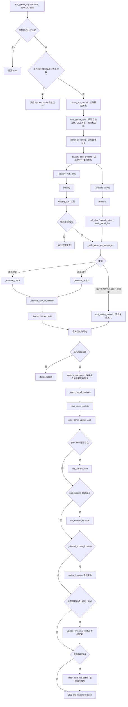

# 中文游戏普通回合流程

`System/game/game_zh.py` 中的普通游戏回合，从分类、准备、正文生成到面板更新。UI、服务器路由和战斗内部流程不在本文展开。

## 总流程

## 入口与上下文读取

### `run_game_zh(username, save_id, text)`

- 输入：
  - `username`：当前用户名。
  - `save_id`：当前游戏存档 ID。
  - `text`：玩家本回合输入。
- 输出：SSE 事件生成器，可能依次产生 `classified`、`thinking`、`content`、`end_bubble`、`done` 或 `error`。
- 工具调用：自身不直接向模型提供 function calling 工具，但负责调用下方的分类、准备、生成和更新函数。
- 主要职责：
  1. 清理玩家输入。
  2. 检查存档是否软锁定。
  3. 如果已经处于战斗或战斗收尾阶段，则交给战斗模块。
  4. 普通回合中读取历史、游戏资料和面板目录。
  5. 并行完成分类与准备。
  6. 根据类别生成回复。
  7. 保存消息。
  8. 执行面板更新计划。
  9. 必要时初始化战斗，否则结束本回合。

### `load_game_data(username, save_id)`

- 输入：用户名和存档 ID。
- 输出：`list`，其中每项都是提供给模型的 `system` 消息。
- 工具调用：无模型工具调用。
- 读取内容：
  - `current_info.json`
  - `characters/allies/*.md`
  - 当前地点对应的 `world/<地点>.md`
  - `plot/cur_main_plot.md`

## 分类阶段

### `_build_classify_messages(history_msgs, text, game_data, panel_dir)`

- 输入：
  - 最近对话历史。
  - 玩家本回合输入。
  - `load_game_data` 返回的游戏资料。
  - 当前面板目录。
- 输出：分类 API 使用的消息列表。
- 工具调用：无；只负责组装消息。

### `classify(history_msgs, user_text, game_data, panel_dir)`

- 输入：历史消息、玩家输入、游戏资料和面板目录。
- 输出：
  - 成功：规范化后的类别字符串。
  - 失败：`None`。
- 工具调用：`classify_tool_zh` 中的 `classify_turn`。
- 调用方式：
  - `tool_choice="required"`，强制模型使用工具。
  - `enable_thinking=False`，关闭思考模式。
- 可返回类别：
  - 元对话
  - 属性检定
  - 游戏动作
  - 角色互动
  - 环境探索

### `_classify_with_retry(history_msgs, user_text, game_data, panel_dir)`

- 输入：与 `classify` 相同。
- 输出：类别字符串或 `None`。
- 工具调用：通过 `classify` 间接调用 `classify_turn`。
- 主要职责：通过 `asyncio.to_thread` 在线程中运行同步分类；失败时最多尝试 `MAX_ATTEMPTS`，当前为 3 次。

## 准备阶段

### `_build_prepare_messages(history_msgs, text, game_data, panel_dir)`

- 输入：历史消息、玩家输入、游戏资料和面板目录。
- 输出：准备 API 使用的消息列表。
- 工具调用：无；只负责组装消息。

### `prepare(history_msgs, user_text, game_data, panel_dir, username, save_id)`

- 输入：
  - 历史消息、玩家输入、游戏资料和面板目录。
  - 用户名和存档 ID，用于读取面板文件。
- 输出：二元组 `(extras, game_data)`。
  - `extras`：骰子结果和 RAG 结果组成的额外 `system` 消息。
  - `game_data`：可能追加了面板文件内容的游戏资料。
- 可调用工具：
  - `roll_dice`：模型决定骰子数量和面数，后端通过 `roll_dice` 得到实际结果。
  - `search_rules`：模型提供查询词，后端调用 RAG 的 `search_rules`。
  - `fetch_panel_file`：模型提供 `.json` 或 `.md` 路径，后端通过 `read_panel_json` 或 `read_panel_md` 读取。
- 特殊情况：模型不调用任何工具时，返回空 `extras` 和原有 `game_data`。

### `_prepare_async(history_msgs, user_text, game_data, panel_dir, username, save_id)`

- 输入：与 `prepare` 相同。
- 输出：`prepare` 返回的 `(extras, game_data)`。
- 工具调用：通过 `prepare` 间接调用准备工具。
- 主要职责：通过 `asyncio.to_thread` 在线程中运行同步的 `prepare`。

### `_classify_and_prepare(history_msgs, user_text, game_data, panel_dir, username, save_id)`

- 输入：分类和准备阶段所需的全部上下文。
- 输出：三元组 `(category, prepare_extras, game_data)`。
- 工具调用：
  - 通过分类任务调用 `classify_turn`。
  - 通过准备任务调用 `roll_dice`、`search_rules` 或 `fetch_panel_file`。
- 主要职责：
  1. 使用两个 asyncio task 并行运行分类和准备。
  2. 如果分类失败，取消并等待准备任务，然后返回 `(None, None, None)`。
  3. 如果分类成功，等待准备完成并返回两边结果。

## 正文生成阶段

### `_build_generate_messages(history_msgs, text, previous_text, category, game_data)`

- 输入：
  - 历史消息和玩家输入。
  - `previous_text`：类别说明以及准备阶段得到的 RAG、骰子等信息。
  - 类别和游戏资料。
- 输出：正文生成 API 使用的消息列表。
- 工具调用：无；只负责按类别选择提示词并组装消息。
- 类别提示词：
  - 元对话：`META_ZH_PROMPT`
  - 属性检定：`CHECK_ZH_PROMPT`
  - 游戏动作：`ACTION_ZH_PROMPT`
  - 角色互动：`INTERACTION_ZH_PROMPT`
  - 环境探索：`EXPLORATION_ZH_PROMPT`
- 补充行为：除元对话外，都会加入 `DM_NOTE_ZH_PROMPT`。

### `_parse_narrate_tools(msg, require_calculation)`

- 输入：
  - 模型返回消息 `msg`。
  - `require_calculation`：是否必须包含计算步骤。
- 输出：
  - 成功：`{"content": <拼接后的正文>}`。
  - 结构不完整：`None`。
- 解析的工具：
  - `narrate_opening`：开场叙述，必须且只能有一个有效结果。
  - `calculation_step`：计算公式与计算结果，可以有多个；属性检定至少需要一个。
  - `narrate_result`：结算叙述，必须且只能有一个有效结果。
  - `dm_note`：可选的 DM 说明，可以有多个。
- 主要职责：验证工具调用结构，并把叙述、计算步骤和 DM 说明合并成最终文本。

### `_resolve_tool_or_content(msg, require_calculation)`

- 输入：模型消息以及是否要求计算步骤。
- 输出：
  - 优先返回 `_parse_narrate_tools` 解析出的正文。
  - 如果工具结构无效但模型提供了普通 `content`，则返回普通正文。
  - 两者都没有时返回 `None`。
- 工具调用：不发起工具调用，只解析模型结果。

### `generate_check(messages, previous_text)`

- 输入：
  - 已组装的正文生成消息。
  - `previous_text` 当前未在函数内部使用。
- 输出：
  - 成功：包含 `content` 和 `thinking` 的字典。
  - 连续失败：`None`。
- 工具调用：`check_tool_zh`，可包含：
  - `narrate_opening`
  - `calculation_step`
  - `narrate_result`
  - `dm_note`
- 主要职责：生成属性检定结果，要求至少一个计算步骤；解析失败时最多重试 3 次。

### `generate_action(messages, previous_text)`

- 输入：
  - 已组装的正文生成消息。
  - `previous_text` 当前未在函数内部使用。
- 输出：
  - 成功：包含 `content` 和 `thinking` 的字典。
  - 连续失败：`None`。
- 工具调用：`action_tool_zh`，可包含：
  - `narrate_opening`
  - `calculation_step`
  - `narrate_result`
  - `dm_note`
- 主要职责：生成游戏动作结果；与属性检定不同，不强制要求计算步骤；解析失败时最多重试 3 次。

### 流式类别生成

- 适用类别：
  - 元对话
  - 角色互动
  - 环境探索
- 输入：`_build_generate_messages` 返回的消息列表。
- 输出：`thinking` 和 `content` 流式事件。
- 工具调用：无。`run_game_zh` 直接调用 `call_model_stream(messages)`。

### 工具类别生成

- 属性检定：通过 `TOOL_HANDLERS` 调用 `generate_check`。
- 游戏动作：通过 `TOOL_HANDLERS` 调用 `generate_action`。
- 输出：非流式的完整 `content` 和可选 `thinking`，再由 `run_game_zh` 转换为 SSE 事件。

## 更新计划阶段

### `_build_update_messages(history_msgs, user_text, content, game_data, panel_dir)`

- 输入：
  - 历史消息。
  - 玩家输入。
  - 本回合已经生成的助手正文。
  - 游戏资料和面板目录。
- 输出：更新计划 API 使用的消息列表。
- 工具调用：无；只负责组装消息。

### `plan_panel_update(history_msgs, user_text, content, game_data, panel_dir, username, save_id)`

- 输入：历史、玩家输入、生成正文、游戏资料、面板目录、用户名和存档 ID。
- 输出：规范化后的更新计划字典。
- 工具调用：`update_tool_zh` 中的 `plan_panel_update`。
- 更新计划字段：
  - `time`
  - `location`
  - `is_inventory_update`
  - `is_status_update`
  - `is_character_update`
  - `is_location_update`
  - `is_battle`
- 失败处理：最多尝试 3 次；仍失败则返回 `EMPTY_UPDATE_PLAN`，本回合不执行任何面板更新。

## 基础信息更新函数

### `set_current_time(username, save_id, time_value)`

- 输入：用户名、存档 ID 和新时间。
- 输出：无。
- 工具调用：无模型工具调用。
- 主要职责：直接修改 `data/current_info.json` 中的 `current_time`。

### `set_current_location(username, save_id, location_value)`

- 输入：用户名、存档 ID 和新地点。
- 输出：无。
- 工具调用：无模型工具调用。
- 主要职责：直接修改 `data/current_info.json` 中的 `current_location`。

### `get_current_location(username, save_id)`

- 输入：用户名和存档 ID。
- 输出：当前地点名称；不存在或为空时返回 `None`。
- 工具调用：无。

### `_location_file_exists(username, save_id, location_name)`

- 输入：用户名、存档 ID 和地点名称。
- 输出：对应 `world/<地点>.md` 是否存在。
- 工具调用：无。

### `_should_update_location(plan, username, save_id)`

- 输入：更新计划、用户名和存档 ID。
- 输出：布尔值。
- 工具调用：无。
- 返回 `True` 的条件：
  - `is_location_update` 为真。
  - 计划中存在新地点，但对应地点文件不存在。

## 地点专项更新

### `_append_location_panel_msg(messages, username, save_id, location_name)`

- 输入：目标消息列表、用户名、存档 ID 和地点名称。
- 输出：无返回值，直接修改 `messages`。
- 工具调用：无。
- 主要职责：
  - 地点文件存在时，把文件正文加入模型上下文。
  - 地点文件不存在时，加入需要创建地点并更新 `map.json` 的系统说明。

### `_build_update_location_messages(history_msgs, user_text, content, panel_dir, username, save_id, current_location_name, new_location_name)`

- 输入：
  - 历史消息、玩家输入和本回合正文。
  - 面板目录、用户名、存档 ID。
  - 旧地点和可选的新地点。
- 输出：地点专项更新 API 使用的消息列表。
- 工具调用：无；只负责组装上下文。
- 加载内容：
  - 旧地点文档。
  - 新地点文档或创建说明。
  - `world/map.json`。
  - 面板目录。

### `update_location(history_msgs, user_text, content, panel_dir, username, save_id, current_location_name, new_location_name)`

- 输入：地点更新所需的完整上下文。
- 输出：无。
- 工具调用：从 MCP filesystem server 获取并限制为：
  - `edit_file`：修改已有地点或 `world/map.json`。
  - `write_file`：创建不存在的新地点文档。
- 调用方式：
  1. 关闭模型思考模式。
  2. 过滤模型返回的工具名，只保留当前允许的 MCP 工具。
  3. 将多个 MCP 工具调用一次提交，并按顺序执行。

## 物品、状态与角色专项更新

### `_load_allies_panel_msgs(username, save_id, kind)`

- 输入：
  - 用户名和存档 ID。
  - `kind`：`status` 或 `characters`。
- 输出：对应友方目录中所有 Markdown 文件组成的 `system` 消息列表。
- 工具调用：无。

### `_build_update_inventory_status_messages(history_msgs, user_text, content, panel_dir, username, save_id, plan)`

- 输入：
  - 历史消息、玩家输入和本回合正文。
  - 面板目录、用户名、存档 ID 和更新计划。
- 输出：物品、状态、角色专项更新 API 使用的消息列表。
- 工具调用：无；只负责组装上下文。
- 按计划加载：
  - `is_inventory_update`：读取 `inventory.md`。
  - `is_status_update`：读取 `status/allies/*.md`。
  - `is_character_update`：读取 `characters/allies/*.md`。

### `update_inventory_status(history_msgs, user_text, content, panel_dir, username, save_id, plan)`

- 输入：物品、状态和角色更新所需的完整上下文。
- 输出：无。
- 工具调用：只允许 MCP filesystem server 的 `edit_file`。
- 调用方式：
  1. 关闭模型思考模式。
  2. 过滤模型返回的工具名。
  3. 将多个 `edit_file` 调用一次提交，并按顺序执行。
- 权限限制：该专项更新不能通过 `write_file` 创建新文件。

## 更新调度与战斗交接

### `_apply_panel_updates(history_msgs, user_text, content, game_data, panel_dir, username, save_id)`

- 输入：本回合完整上下文。
- 输出：二元组 `(plan, battle_parts)`。
  - `plan`：更新计划。
  - `battle_parts`：战斗初始化成功后需要输出的内容；未开始战斗时为 `None`。
- 工具调用：
  - 通过 `plan_panel_update` 间接调用 `plan_panel_update` 工具。
  - 通过 `update_location` 间接调用 `edit_file` 和 `write_file`。
  - 通过 `update_inventory_status` 间接调用 `edit_file`。
  - `is_battle` 为真时，通过战斗模块执行战斗初始化工具，具体流程不在本文展开。
- 执行顺序：
  1. 生成更新计划。
  2. 直接更新时间。
  3. 读取旧地点并直接写入新地点名称。
  4. 必要时执行地点专项更新。
  5. 必要时执行物品、状态、角色专项更新。
  6. 必要时检查并初始化战斗。

## 函数调用顺序摘要

普通回合的核心调用顺序如下：

1. `run_game_zh`
2. `history_for_model`
3. `load_game_data`
4. `panel_dir_listing`
5. `_classify_and_prepare`
   - `_classify_with_retry` → `classify` → `_build_classify_messages`
   - `_prepare_async` → `prepare` → `_build_prepare_messages`
6. `_build_generate_messages`
7. 按类别选择：
   - `call_model_stream`
   - `generate_check` → `_resolve_tool_or_content` → `_parse_narrate_tools`
   - `generate_action` → `_resolve_tool_or_content` → `_parse_narrate_tools`
8. `append_message`
9. `_apply_panel_updates`
10. `plan_panel_update` → `_build_update_messages`
11. `set_current_time`
12. `get_current_location`
13. `set_current_location`
14. `_should_update_location` → `_location_file_exists`
15. `update_location` → `_build_update_location_messages` → `_append_location_panel_msg`
16. `update_inventory_status` → `_build_update_inventory_status_messages` → `_load_allies_panel_msgs`
17. 必要时 `check_and_init_battle`
18. `run_game_zh` 返回本回合结束事件
